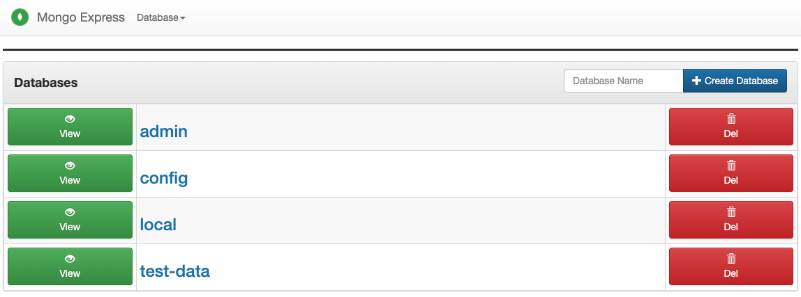
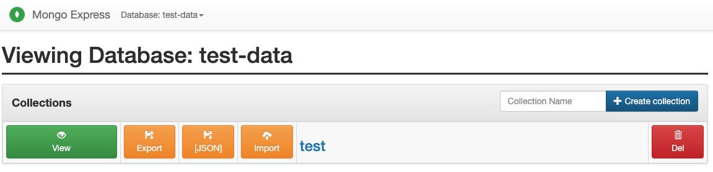
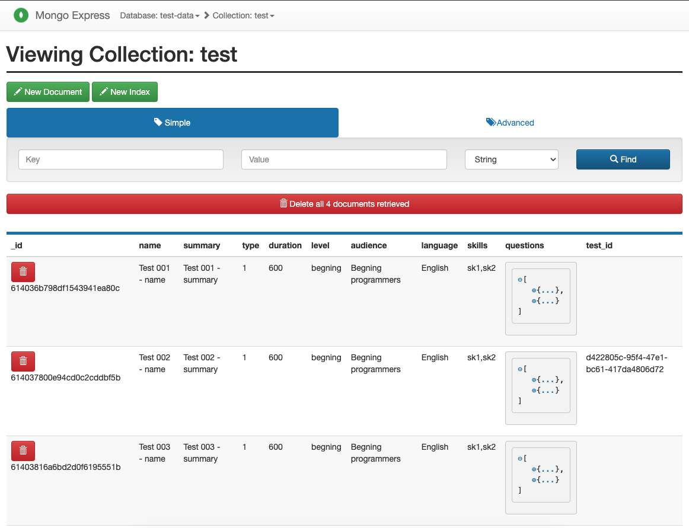
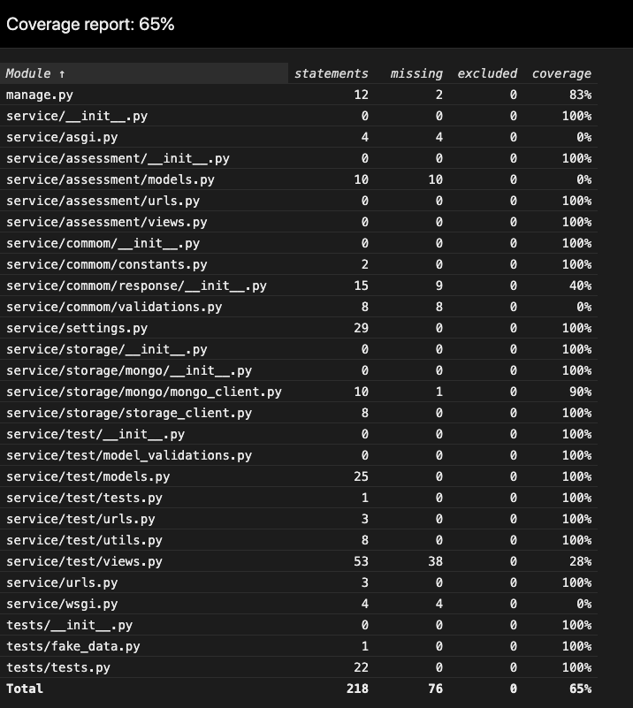

## Warning
This project was developed in September of 2021, some steps on [How to run](#how-to-run), mainnly its dependencies, may be out of date.

## Description
This is a showcase project to demonstrate a simple webserver with a No-SQL database. The main technologies used are:
- Python
- Django
- MongoDB


## Table of Contents

- [Warning](#warning)
- [Description](#description)
- [Table of Contents](#table-of-contents)
- [How to run](#how-to-run)
- [Data and Logic](#data-and-logic)
- [DB Visualization](#db-visualization)
- [Tests](#tests)
- [Improvements](#improvements)
- [Docker and Docker compose useful commands](#docker-and-docker-compose-useful-commands)


## How to run
This project was implemented with the help of Docker and Docker Compose. To run it you must have docker and docker-compose both installed in your machine. The steps to install them can be found below:

1. First you need to [install docker](https://docs.docker.com/get-docker/):

2. Check if Docker is installed by simply typing the following command on the terminal:
```shell
docker --version
```

3. Then install docker-compose:
- Using Curl
```shell
curl -L https://github.com/docker/compose/releases/download/1.8.0-rc2/docker-compose-`uname -s`-`uname -m` > /usr/local/bin/docker-compose
chmod +x /usr/local/bin/docker-compose
```

- Using pip
```shell
pip install docker-compose
```

4. Check if docker-compose is installed, by simply open a terminal and running:
```shell
docker-compose --version
```

After making sure Docker and Docker Compose are installed you can run the project that is composed of 3 environments:

- Development: Runs both the database and the project, and also Mongo Express wich is a GUI (Graphical User Interface) to visualize and manage the mongo collections and databases;
- Deployment: Same as the Development environment, but without running Mongo Express;
- Testing: Run unit|integration tests and generate a test coverage report in HMTL. `mongomock` was used to mock the interaction between the application and MongoDB.  
  
To start a environment you will need to run some Docker Compose commands. As it has 3 environments, 3 differents docker-compose files were create to architect and run the services following the above environment specifications.  
The docker files are located in the root folder, named by `docker-compose` and its variations:
- `docker-compose.yml`
- `docker-compose-dev.yml` 
- `docker-compose-test.yml`

To run an environment, replace the key `DOCKER_FILE` below, and do:
```shell
# Build the service images
docker-compose -f <DOCKER_FILE> build
```

```shell
# Start the services in detached (background) mode
docker-compose -f <DOCKER_FILE> up -d 
```

After running the above commands, the application should be up. You can check the current status by typing:
```shell
docker-compose -f <DOCKER_FILE> ps
```

Something like that will be prompted to you
```shell
             Name                            Command               State                      Ports
-----------------------------------------------------------------------------------------------------------------------
showcase_mongo-db_1              docker-entrypoint.sh mongod      Up      0.0.0.0:27017->27017/tcp,:::27017->27017/tcp
showcase_mongo-express_1         tini -- /docker-entrypoint ...   Up      0.0.0.0:8081->8081/tcp,:::8081->8081/tcp
showcase_django-server_1   sh ./start.sh                    Up      0.0.0.0:8080->8080/tcp,:::8080->8080/tcp
```

You gonna have some services running, depending on each docker file you choosed. The last column has the ports that you can access to reach each service. To use any service just point to localhost - or 0.0.0.0 - and the respective service port, e.g. http://localhost:8080 .


## Data and Logic
The test model has the following structure:

```js
"Test": { // Document
    "name": "string",
    "summary": "string",
    "type": "int",
    "duration": "int", // in seconds
    "level": "string",
    "audience": "string",
    "language": "string",
    "skills": "List[string]",
    "questions": "List[Question]"
}

"Question" : { // Embedded Document
    "text": "string",
    "answers": "List[Answer]",
    "correctAnswers": "List[UUID]", // List of Answer ids
    "userAnswer": "List[UUID]", // List of Answer ids
    "order": "int" // To be displayed in the Test flux page
}

"Answer": { // Embedded Document
    "id": "UUID",
    "text": "string"
}
```

With this models, it's possible to manage the following question types:
- Multiple-choice type:  
In this case we gonna have questions with a list of a possible **answers**, and the **correctAnswers** attribute will only have a single **answer** id, representing the Id of the correct answer option.
- Multiple-response type:  
Pretty similar to the above type (Multiple-choice) but now having more than one Id on the **correctAnswers** attribute
- True or false:  
In this case we gonna have only two **answers** (True or False) and the **correctAnswers** attribute will only have one of the **answers** Id, ether True or False. Almost the same as Multiple-choice type.
- Short text:  
Different from the others, for this type we gonna have the **answers** attribute empty and in the **correctAnswers** one we will have all the match possibilities to validate the inputted answer

The user answer (**userAnswer**) is validated according to the **correctAnswers** attribute.


## DB Visualization
In the development environment, we can visualize the data in a user-friendly way. After running the development environment, simply open your preferred browser and type `localhost:8081` - or you can just [click here](http://localhost:8081).

You will open a page similar to the following:


Access the database (test-data) by clicking on the blue link named `test-data` or in the green button next to it, you can visualize the collections within that DB as follows:


To view a specific collection, click on its name or the green button. You should see something like this page:


It's not restricted only to visualization, feel free to also CRUD (create, read, update and delete) any collection, if needed.


## Tests
As previously mentioned, this project has a test environment that runs the unit tests (actually it only has one, just for demonstration) and outputs its results and coverage in a HTML page. To have it you only need to `up` the test service/environment by running the docker compose with the `docker-compose-test.yml` file.

After executing the command, a few files should appear in the `coverage` folder located in the root level of this project, go ahead and open the `index.html` file to see the test coverage report that should look like the following:



## Improvements
This is a simple project for showing some of my code skills, and I wish I would have coded more features and showed a little bit more of what I can do. Below are some features and aspects that I would like to have done in this project:
- Environment variables:  
Make docker-compose files cleaner and separate all the environment variables in a specific folder with a env file for each environment. Instead of declaring it directly in the docker-compose files.
- Custom Exception classes:  
Make it better to validate and check errors and exceptions
- Logging for code and DB commands:  
To improve excution follow up and analyze flows
- Cache control:  
Python mongoengine library has a cache enabled by default, a nice-to-have feature is the ability to control it via `cache-headers` in the request
- Get CSRF Token from cookie:  
Instead of avoiding CSRF Token check get it from the response cookie
- Separeted user answer:  
To improve collection reusability duplicate duplicate Question collection - and maybe the Test.


## Docker and Docker compose useful commands
These are commands that helped me to run, re-run, and manage the project containers:   

```shell
docker run -d --name some-mongo -e MONGO_INITDB_ROOT_USERNAME=admin -e MONGO_INITDB_ROOT_PASSWORD=pwd -p 27017:27017 mongo
docker exec -it CONTAINER_ID /bin/bash
docker-compose -f docker-compose-dev.yml build --no-cache SERVICE
docker-compose -f docker-compose-dev.yml up -d --remove-orphans
docker-compose -f docker-compose-dev.yml logs -f
docker-compose -f docker-compose-dev.yml ps
docker-compose -f docker-compose-dev.yml stop SERVICE
docker-compose -f docker-compose-dev.yml rm
docker-compose -f docker-compose-dev.yml down
```
